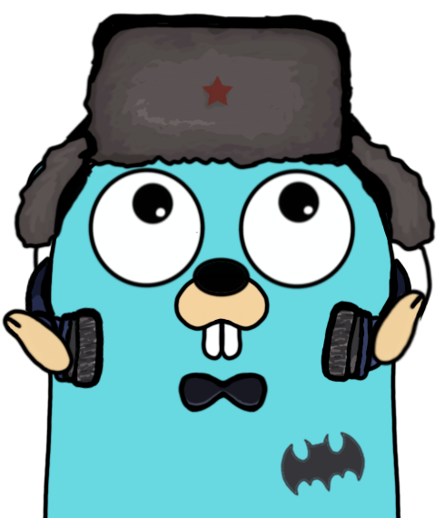

# Golance 

   

Fast, feature-rich Golang language support

# Tasks

- [x] Auto Imports
- [x] Automatic creation of a basic structure
- [x] Docstrings
- [ ] Type Hints
- [ ] Signature help, with type information
- [ ] Parameter suggestions
- [ ] Code completion
- [ ] Type checking mode
- [ ] As-you-type reporting of code errors and warnings (diagnostics)
- [ ] IntelliCode compatibility
- [ ] Semantic highlighting

# Contribute

That said, there's a bunch of ways you can contribute to this project, like by:

* ⭐ Giving a star on this repository (this is very important and costs nothing)
* 🪲 Reporting a bug
* 📄 Improving this documentation
* 🚨 Sharing this project and recommending it to your friends
* 💻 Submitting a pull request to the official repository

## Contributors

This project exists thanks to all the people who contribute. 

